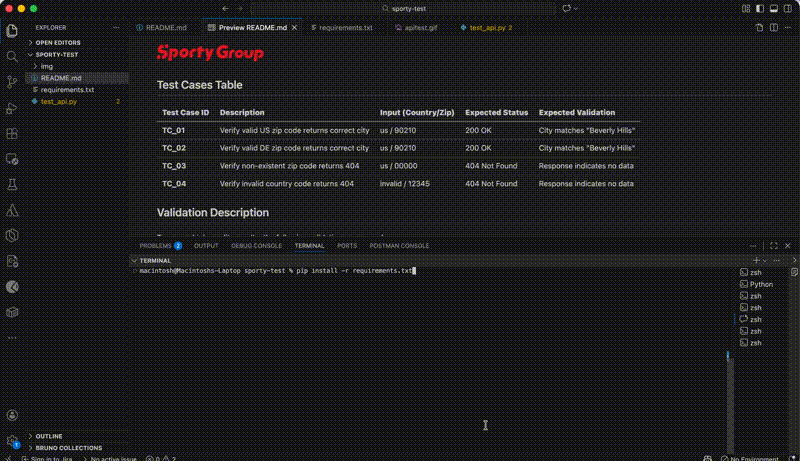

## Test Cases Table

| **Test Case ID** | **Description** | **Input (Country/Zip)** | **Expected Status** | **Expected Validation** |
|:-------------|:------------|:--------------------|:-------------------|:--------------------|
| **TC_01** | Verify valid US zip code returns correct city | us / 90210 | 200 OK | City matches "Beverly Hills"|
| **TC_02** | Verify valid DE zip code returns correct city | us / 90210 | 200 OK | City matches "Beverly Hills"|
| **TC_03** |	Verify non-existent zip code returns 404 | us / 00000 | 404 Not Found | Response indicates no data |
| **TC_04** |	Verify invalid country code returns 404 |	invalid / 12345	| 404 Not Found	| Response indicates no data |

## Test Result Validation
To ensure high-quality results, the following validations were used:
- Status Code Validation: Confirms the API responds with `200 OK` for valid inputs and `404 Not Found` for invalid inputs, ensuring basic endpoint reliability.
- Data Integrity Check: For successful requests, the script parses the JSON response and asserts that the first `place name` matches the expected value, verifying that the API returns accurate business data.
- Schema Presence: Validated that essential keys like post code exist in the response body to ensure the data structure remains consistent



## Installation
1. Run `pip install -r requirements.txt` to install the dependencies
2. Run `pytest test_api.py -v` to execute tests showing each test name and PASSED/FAILED instead of just dots
or `pytest --html=api_test_report.html --self-contained-html -v` to run test with report

## Framework Design

### Architecture Overview
```
sporty-test/
├── test_api.py          # Test Layer — assertions only, zero hardcoded data
├── conftest.py          # Config Layer — hooks & report customisation
├── pytest.ini           # Framework Config — global settings & markers
├── requirements.txt     # Dependency Management
├── data/
│   └── test_data.py     # Data Layer — all test inputs & expected outputs
├── client/
│   └── api_client.py    # Client Layer — all HTTP calls (requests.get)
├── assets/
│   └── style.css        # Reporting Layer — custom styling
└── img/
    └── logo.svg         # Branding assets
```

### Design Pattern: Data-Driven Testing
Test data, HTTP logic, and assertions live in **separate files**. Adding a new test case requires editing only `data/test_data.py` — no changes to the test or client layers:

```python
# data/test_data.py — add a new dict to extend coverage
TEST_CASES = [
    {
        "id":              "TC_01 | HappyPath_US_ValidZip",
        "country_code":    "us",
        "zip_code":        "90210",
        "expected_status": 200,
        "expected_place":  "Beverly Hills",
        "marks":           ["smoke", "regression"],
    },
    # add more cases here...
]
```

`build_params()` in `test_api.py` reads `TEST_CASES` at collection time and builds the parametrize list dynamically — including any `pytest.mark` decorators defined per case.

### Layers
```
┌─────────────────────────────────────────┐
│     DATA LAYER  (data/test_data.py)     │  ← Test inputs, expected outputs, marks
├─────────────────────────────────────────┤
│   CLIENT LAYER  (client/api_client.py)  │  ← HTTP calls, base URL, timeout
├─────────────────────────────────────────┤
│     TEST LAYER  (test_api.py)           │  ← Assertions only, no raw requests
├─────────────────────────────────────────┤
│   CONFIG LAYER  (conftest.py)           │  ← Hooks, report customisation
├─────────────────────────────────────────┤
│ SETTINGS LAYER  (pytest.ini)            │  ← Log level, markers, report options
├─────────────────────────────────────────┤
│REPORTING LAYER  (HTML report)           │  ← Results, logs, styling
└─────────────────────────────────────────┘
```

### Request Flow
```
pytest runs
    │
    ▼
conftest.py loads (hooks registered)
    │
    ▼
data/test_data.py → TEST_CASES list loaded
    │
    ▼
build_params() → parametrize list built dynamically
(marks, ids, inputs all sourced from TEST_CASES)
    │
    ▼
test_api.py collects N parametrized test cases
    │
    ▼
For each test:
    ├── Log test banner (TC_01 | ...)
    ├── client/api_client.py → get_location() sends GET request
    ├── Validate status code
    ├── If 200 → validate place name + post code
    └── If 404 → confirm expected failure
    │
    ▼
pytest-html generates HTML report
```

## Custom HTML Report Without Filters/Controls

To generate a test report without filter controls or the controls section, use the provided custom pytest-html template:

```
pytest --html=api_test_report.html --self-contained-html --template=assets/pytest-html-template/simple_no_filters.html -v
```

This will produce a report with no filter checkboxes or controls UI.